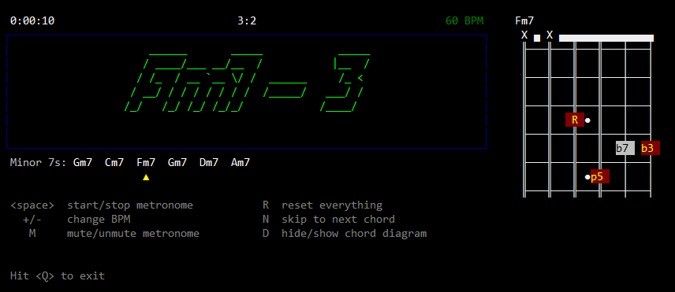

# chord_trainer2
show a chord on a regular time interval for practicing guitar.



<!--
# [Demo Video](chord_trainer_demo_1.mp4 "chord_trainer.py demo video")


# usage
```
usage: .\chord_trainer.py -i <device ID> -o <device ID> -b <bpm> -c <chords> -d -v <device> -h

-i <device ID>, --input   : use this device ID for input
-o <device ID>, --output  : use this device ID for output
-b <bpm>,       --bpm     : set tempo to <bpm>
-c <chords>,    --chords  : use comma separated list as chart (eg. "-c Am,D,Gm,C")
-d,             --devices : list all audio devices
-e <beats>,     --beats   : beats per chord
-v <device>,    --verbose : show device(s) with verbose info (eg. "-v Speaker" shows all
                            devices with "Speaker" in its name)
-h,             --help    : show usage information
```
   -->
  
# Acknowledgements
written by [Carmen DiMichele](https://dimichelec.wixsite.com/carmendimichele) 

